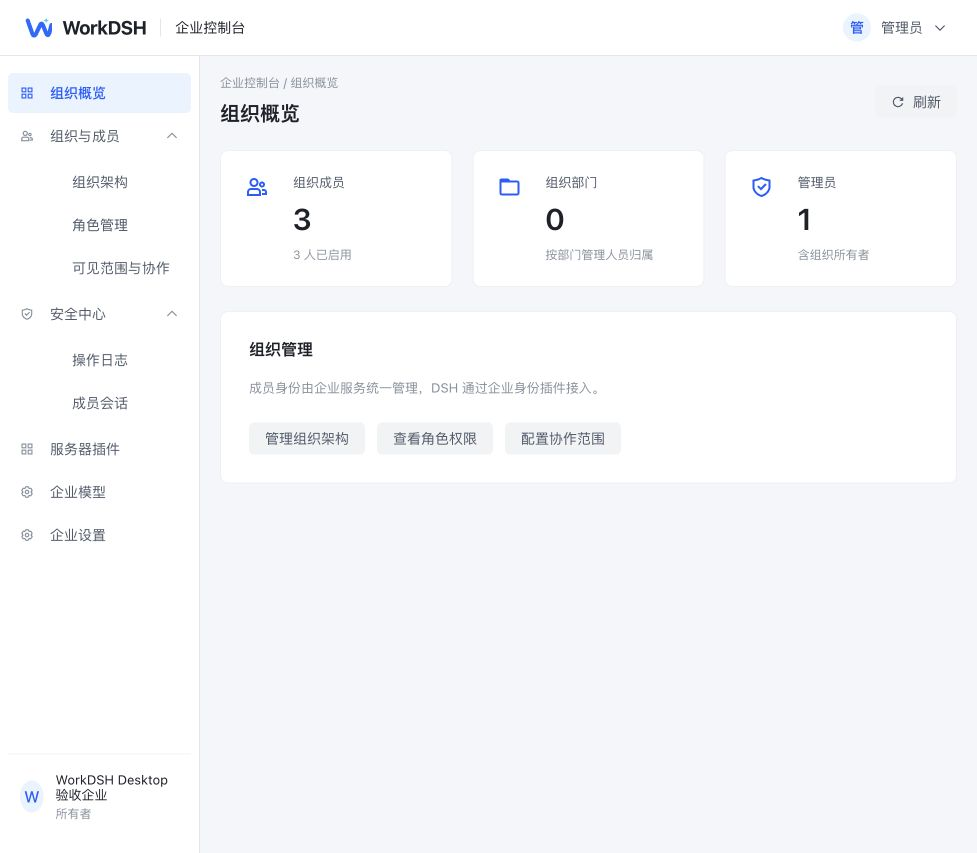

# WorkDSH Admin

企业管理后台与内部模型 API，使用 Spring Boot / Spring AI、Vue 3 / Arco。当前处于开发验收阶段。管理后台拥有组织、成员、部门、角色权限、协作记录、成员数据库存储、成员会话只读审计和公司模型接口；官方 DSH 负责模型选择、会话和 Agent 执行。

## 运行与交付边界

企业 Agent、工具和工作区只在员工桌面客户端运行。服务器提供管理后台，负责账号、组织、权限、协作数据、桌面可见正文审计与 Spring AI 模型转发，不部署 ECS 成员 DSH 进程、成员网关或服务器会话存储。

Desktop 使用同一个基础安装包，企业账号和协作插件由用户显式安装。安装插件不赋予企业权限；后台验证成员身份、状态和组织归属。普通成员不能访问管理 API，管理员读取正文按组织授权并记录审计。

## 本地开发

需要 Java 17+、Maven 3.9+、Node 22.19+ 或 24+。首次启动通过受控环境设置 `WORKDSH_BOOTSTRAP_ADMIN_EMAIL` 和至少 12 位的 `WORKDSH_BOOTSTRAP_ADMIN_PASSWORD`。不要把实际凭据写入命令历史、日志或源码。

```sh
mvn -f server/pom.xml spring-boot:run
```

另一个终端：

```sh
cd web
npm ci
npm run dev
```

管理网页默认 `http://127.0.0.1:18891/`，Java 默认 `127.0.0.1:18890`。默认开发数据库为 `server/data` 下的 H2。企业服务器显式选择 `enterprise-mysql`、`enterprise-postgres` 或测试用 `enterprise-sqlite`；见 [数据库配置](docs/ENTERPRISE-DATABASES.md)。开发态旧测试数据库与 Profile 不做兼容迁移；使用当前新库 schema 初始化独立验收环境。不要对已运行数据库直接重跑新库 schema。

后台私密存储需要 `WORKDSH_SECRETS_ENCRYPTION_KEY`（32 字节随机密钥的 Base64）和服务器间 `WORKDSH_SECRETS_SERVICE_KEY`。凭据在包外管理，不下发浏览器。登录只使用实际成员密码，没有简单测试账号替换逻辑。

## 公司内部模型 API

管理员在「企业模型 API」配置多个接口：上游 HTTPS 地址、供应商 API Key、OpenAI Chat Completions 或 Anthropic Messages 协议、启用状态及允许的模型目录；另设置至少 32 位的内部访问 Key。供应商密钥加密保存、仅供服务器请求上游；管理员主动查看已保存 Key 使用 no-store 响应并记录审计。

成员在官方 DSH 设置的「自定义模型 API」中手动填写内部 API 的实际访问地址、内部 Key、协议与模型 ID，例如 `https://<内部服务地址>/api/model-gateway/v1`。模型目录为 `GET /api/model-gateway/v1/models`；推理端点为 `POST /chat/completions` 和 `POST /messages`。内部 Key 只授权模型调用，不能登录后台。后台不向 DSH 自动注入企业模型、不替换官方设置页，也不执行第二套 Agent loop。

后台通过 Spring AI 传输 OpenAI 请求与 Anthropic 非流式请求；Anthropic SSE 保留原生事件透明转发。内部 Key 当前为组织共享调用凭据，不是逐成员计费凭据。模型目录手工维护，没有上游自动发现。模型参数扩展、上游错误与取消仍需官方 DSH 完整对话兼容验收。

## 企业 Desktop 正文同步

企业模式启用已安装账号插件的 Desktop 可通过新的成员 Bearer API 同步用户/助手可见正文，使用独立 `desktop-body:` 命名空间、稳定请求回执、不可变追加与删除墓碑。Desktop Main 代理固定接口，Host 不持后台凭据。现有管理员按组织授权只读查看并留审计；这些成员设备提交的正文不是可信终端完整审计。API 字段、限额、重试和删除语义见 [Desktop 正文接口](docs/DESKTOP-VISIBLE-SESSIONS-API.md)。后台接口测试不代替 Desktop 安装与实际同步验收。

## 构建与候选交付

```sh
mvn -f server/pom.xml clean test package
npm --prefix web run build
python3 scripts/test-admin-release.py
python3 scripts/test-admin-packaged.py --java /absolute/path/to/java
node --test scripts/test-admin-loopback-front.mjs
python3 scripts/pack-admin-release.py --output /private/tmp/workdsh-admin-candidate.zip
```

封闭包只收录后台 JAR、管理前端、已审查 Docker 配方、数据库维护文件。包不含成员运行实例、数据库、账号、密钥、证书或个人 Home。安装器 `scripts/install-admin-release.py` 校验清单与 SHA256，拒绝覆盖或不安全路径；详细步骤见 [后台交付](deploy/ADMIN-SERVER-CANDIDATE.md)。

## 企业 Desktop 接入

用户进入个人空间安装企业账号与协作插件，从工作区菜单连接企业后台并登录。后台地址可由管理员通过 `WORKDSH_DEPLOYMENT_CONFIG` 预置；配置不含账号、密码或模型密钥。个人与企业空间分别保存本机数据和凭据。

成员在官方“设置 → 模型 → 自定义模型 API”中填写公司内部地址、访问 Key、协议和模型 ID。供应商 Key 保存在后台；Agent 和工具在本机执行。

## 管理后台截图


